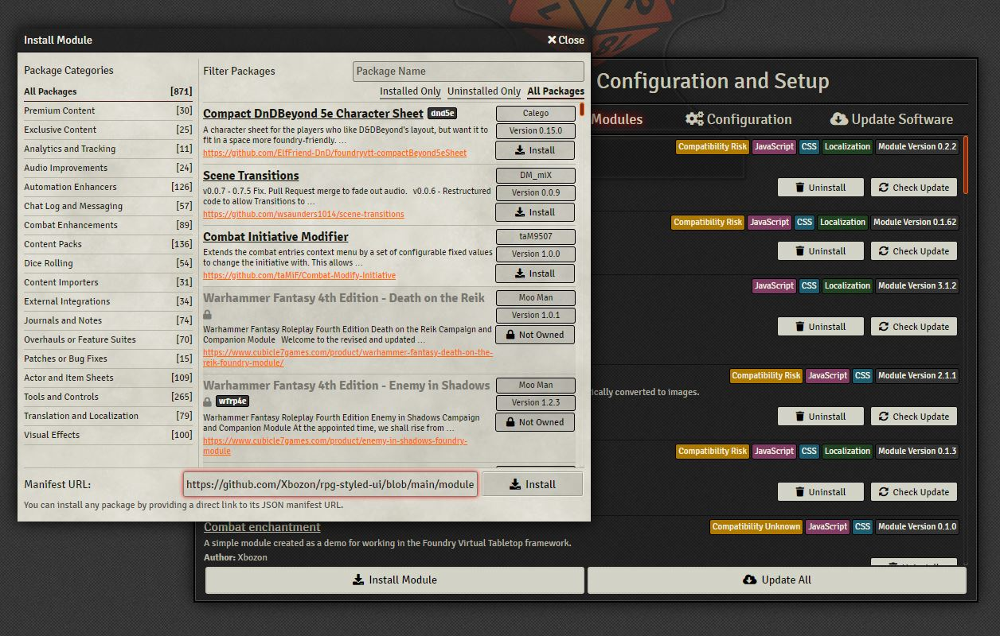
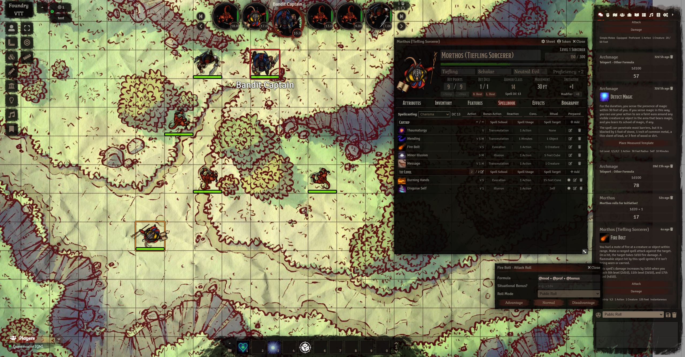

# RPG Styled UI
Foundry VTT DnD5e RPG Styled UI

A simple styling for FoundryVTT in black and red. Includes:
- Chat layout.
- Dialog Boxes Layout
- Character Sheet
- NPC Sheet
- Integration with [Combat Carousel](https://github.com/death-save/combat-carousel-public)

Originally made it for a campaign I run for friends and thought to make it commercial later on, but...
I'm so grateful to all the developers of free modules for Foundry, so I decided to release completely free. 

Special thanks:

- [Dice So Nice!](https://gitlab.com/riccisi/foundryvtt-dice-so-nice)
- [Midi QOL](https://gitlab.com/tposney/midi-qol)
- [Combat Carousel](https://github.com/death-save/combat-carousel-public)
- [Combat utility belt](https://github.com/death-save/combat-utility-belt)
- [Dynamic Effects](https://gitlab.com/tposney/dae)

## Update policy
I don't have a lot of free time, but I will try to maintain this module as much as possible.

## Planned

- Replace the standard buttons on the tabs
- Styling map notes. (Please email me if you can draw them in the style of the book)
- Styling map pins
- Converting png/jpg to webp

# How to install
Copy link ```https://github.com/Xbozon/rpg-styled-ui/blob/main/module.json``` to



# How it looks


Map by [Neutral Party](https://www.patreon.com/neutralparty)